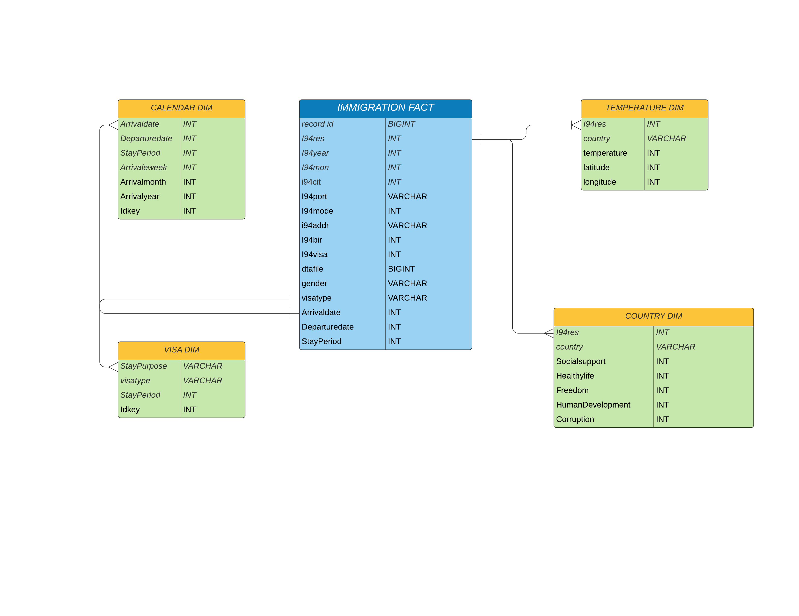

# Data Engineering Capstone Project: 
# i-94 Immigration Analtyics 

##### PROJECT SUMMARY: 
The purpose of this project to create an open analytical database for consumption by US Government so they are able to understand immigration patterns.

A use case for this analytics database is to find immigration patterns for the US immigration department.

For example, they could try to find answears to questions such as,

- Do people from countries with warmer or cold climate immigrate to the US in large numbers?
- Do people come from developed countries?
- Does Freedom and Human development imply in the number of people coming in to the us?

##### Data Sources
- I94 Immigration Data: This data comes from the US National Tourism and Trade Office. A data dictionary is included in the workspace.
- World Temperature Data: This dataset came from Kaggle. You can read more about it here.
- U.S. City Demographic Data: This data comes from OpenSoft. You can read more about it here.
- Happiness data & Human Development data: 
The World Happiness Report is a well-known source of cross-country data and research on self-reported life satisfaction. The table here shows, country by country, the ‘happiness scores’ extracted this report

All the data for this project was loaded into S3 prior to commencing the project. 

Built With
The section covers tools used to enable the project.

1) Amazon EMR process data and output to s3
2) PySpark to process and carry out ETL
3) Bash to create the infrastructure and delete the infrastructure

##### Data Model

## Project Files

1. etl.py - Contains all the logic to extract data from S3 and process data on spark and then load data as parquet files into the s3 folder and region specified by user.
2. sparkSubmit.sh - Shell file that will get executed on the emr cluster and will call the spark submit on the cluster and will run the etl.py
3. createCluster.sh - Contains the pipeline to automate infrastructure requirements which will create the emr cluster, load the etl.py file on the cluster and load data from udacity s3 into user specific s3 bucket
4. terminateCluster.sh - Contains the pipeline to destroy the infratsructure associated with the project.

## Extra Files

- Captsone Project Template.ipynb contains all the exploring, building the the data pipeline steps, including quality checks and answers all the project related questions in more detail.

- helperFunctions.py has some functions that will be used by spark to run jobs.

- i94MetadataMappings.py has various mappings of fields and codes that are used by immigration. These mappings are leveraged in spark job to perform etl and build some dimension tables

- qualityTests.py has quality tests that are used by etl to assess quality of the data, so no poor quality data is created

## Running the ETL pipeline

1. Create the editor role in aws iam

2. Configure the aws cli with the editor role access key and secret.

3. Create the ssh key pair for ec2 instance using aws cli, give it a name such as my-key-pair. Make sure key is stored in root directory and is in the same region in which emr cluster/ec2 instances will be created. aws ec2 create-key-pair --key-name my-key-pair --query "KeyMaterial" --output text > my-key-pair.pem

4. If you're connecting to your instance from a Linux computer, it is recommended that you use the following command to set the permissions of your private key file so that only you can read it. chmod 400 MyKeyPair.pem

5. Open terminal

6. Run createCluster.sh script to create the emr cluster and execute the spark job on the cluster .Pass the cluster name as first choice of argument and name of the key associated with ec2 instance

bash createCluster.sh <cluster_name> <keyName>

## Destrying the infrastructure to avoid costs

1.Run TerminalCluster.sh that will eliminate the cluster

Updates are on going...
